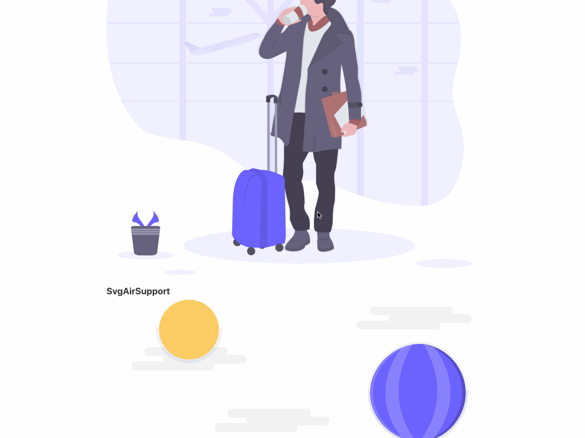

# Iblis React Undraw

_**React component library for undraw.co (1028 illustrations)**_

[](https://www.npmjs.com/package/iblis-react-undraw)



You can find all undraw illustrations here: [Undraw.co](https://undraw.co/illustrations)

## Demos

- [All library illustrations](https://vdelacou.github.io/iblis-react-undraw/iframe.html?id=iblis-react-undraw--page&viewMode=docs)

## Why

Undraw is wonderful and you can use the illustrations published on unDraw for personal and commercial projects, without the need to include attribution.
I always think my projects looks more professional and funnier with illustrations. As we say a picture is worth a thousand words.

There are lot of others undraw react components

- [React UnDraw Illustrations](https://www.npmjs.com/package/react-undraw-illustrations)
- [React UnDraw](https://www.npmjs.com/package/react-undraw)

But no React component libraries has the following requirements :

- Written in pure Typescript
- Have up-to-date illustrations
- Compile with esNext (I don't want have all the svg in my final bundle when I use only one illustration)
- Can customize the main colors

## Documentation and Basic Usage

All props can be found here

- [Properties](https://vdelacou.github.io/iblis-react-undraw/iframe.html?id=iblis-react-undraw-props--page&viewMode=docs)

Basic Usage

```jsx
import React, { FunctionComponent } from 'react';
import { Svg3DModeling } from 'iblis-react-undraw';

export const BasicUsage: FunctionComponent = () => {
  return <Svg3DModeling />;
};
```

You can extend all the properties of React.SVGProps<SVGSVGElement>

By default you can change the height of the components and the width will be set to '100%'

## Install

Install the library and the dependencies to your React project

`npm install iblis-react-undraw`

## Dev

To launch dev environement with storybook `npm run start`

Then you will be able to see your components and test it on http://localhost:9010

All the documention and test are done in the `stories` folder

## Test

You can launch test by running `npm run test`

## To rebuild the project and update with the new undraw design

First download all new svg

```
cd scripts/scrap_website/
npm install
node index.js
```

Then generate the typescript components

```
cd ../generate_components/
npx @svgr/cli --config-file .svgrrc.js --ext tsx --out-dir ../../src/components ../scrap_website/undraw
```

Then add the new components in `src/index.ts` and in `stories/demo.stories.mdx`

Build the library

`npm run tsc`

or

```
export NODE_OPTIONS=--max_old_space_size=4096
npm run build
```

## Contribute

1.  [Fork](https://help.github.com/articles/fork-a-repo/) this repository to your own GitHub account and then [clone](https://help.github.com/articles/cloning-a-repository/) it to your local device
2.  Make the necessary changes and ensure that the tests are passing
3.  Send a pull request

## Todo

- Write more tests with jest

## Known issues

- None for the moment

## Thanks

- [Undraw.co](https://undraw.co) for the fantastic work and the keep going illustrations. It's just amazing!

## License

Please, refer to [LICENSE](https://github.com/vdelacou/iblis-react-native-undraw/blob/master/LICENSE) file
